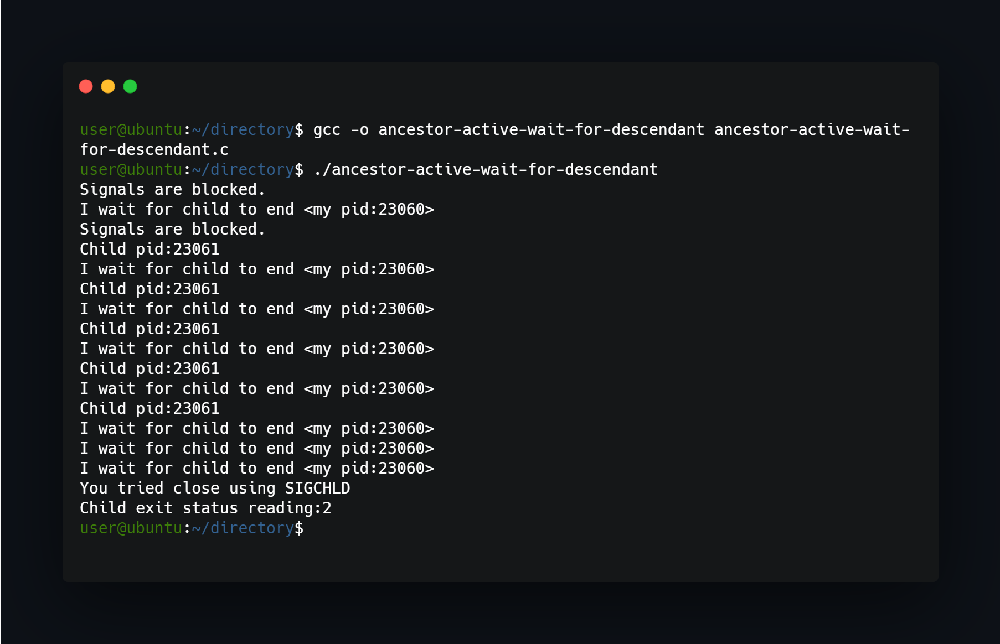
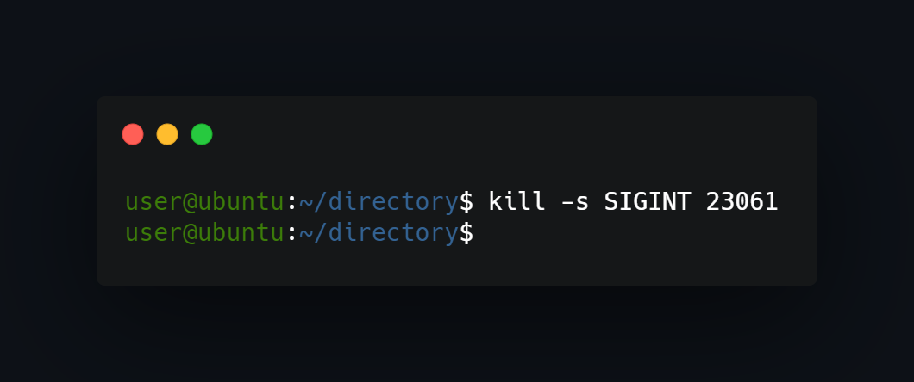

## What project do?
Program shows actively waiting parent for child (which is killed from second terminal). That secure child process from becoming zombie.




*note that you must execute command on child pid in the second terminal. Otherwise zombie process will be a nightmare.*

## How to use?
Just compile and run:
```
gcc -o ancestor-active-wait-for-descendant ancestor-active-wait-for-descendant.c 
./ancestor-active-wait-for-descendant 
```
Then in other terminal use:
```
kill -s SIGINT <PID>
```

<!--https://banner.godori.dev/ height:150-->
<!--https://shields.io/-->
<!--https://carbon.now.sh/-->